# !!! [Keep Android Open↗](https://keepandroidopen.org) !!!

In August 2025, Google [announced↗](https://developer.android.com/developer-verification) that as of September 2026, it will no longer be possible to develop apps for the Android platform without first registering centrally with Google. This registration will involve:

- Paying a fee to Google
- Agreeing to Google’s Terms and Conditions
- Providing government identification
- Uploading evidence of the developer’s private signing key
- Listing all current and future application identifiers

# How you can help

### Developers: Resist and refuse

If you are an app developer, do not sign up for the early access program, perform identity verification, or accept an invitation to the Android Developer Console. Respond (politely) to any invitation with a list of your concerns and objections.

—— It is only through developer acquiescence and capitulation that their takeover plan can possibly succeed. ——

Discourage fellow app developers and organizations from signing up to the program. Use community forums, social media, and blog posts to spread the message. Include the [FreeDroidWarn library↗](https://github.com/woheller69/FreeDroidWarn) in your code to inform your app users. If you manage a web site, consider [adding the countdown banner↗](https://keepandroidopen.org/banner/) to the top of your page.

If you are a Google employee or contractor of good conscience and have additional insight about the program, including planned technical implementation details or additional rationales for the program, please reach out to tips@keepandroidopen.org from a non-work machine and a non-gmail account. Your information will be kept in strict confidence.

#  Hacki for Hacker News

A [Hacker News](https://news.ycombinator.com/) client built with Flutter.

  

Features:
- Log in using your Hacker News account.
- Browse stories from various categories.
- Search for stories.
- Submit stories.
- Pin stories.
- Mark stories as favorite.
- Leave comments.
- Collapse comments.
- View parent comments without scrolling up.
- View and participate in polls.
- Browse comments and stories you have posted.
- Vote on comments or stories.
- Get in-app notification when there is new reply to your stories or comments.
- Download stories and comments for offline reading.
- Pick up where you left off.
- Synced favorites and pins across devices. (iOS only)
- Export or import your favorites. 
- Launch from system share sheet.
- Share story or comment as image.
- And more...

    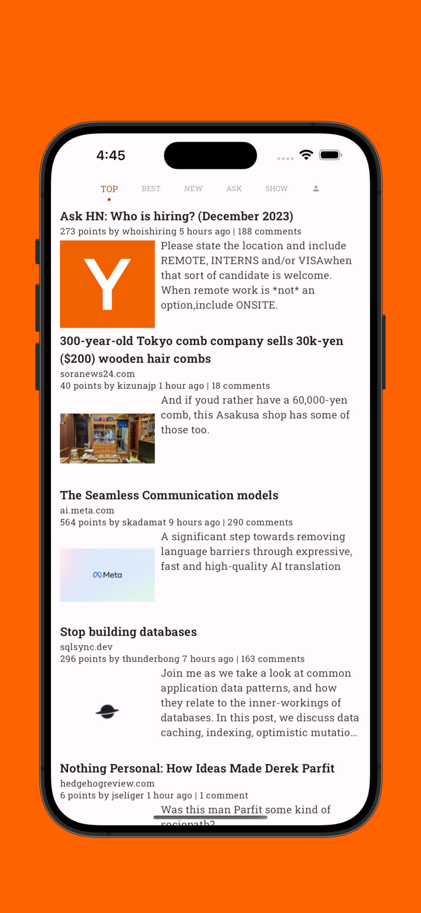 
    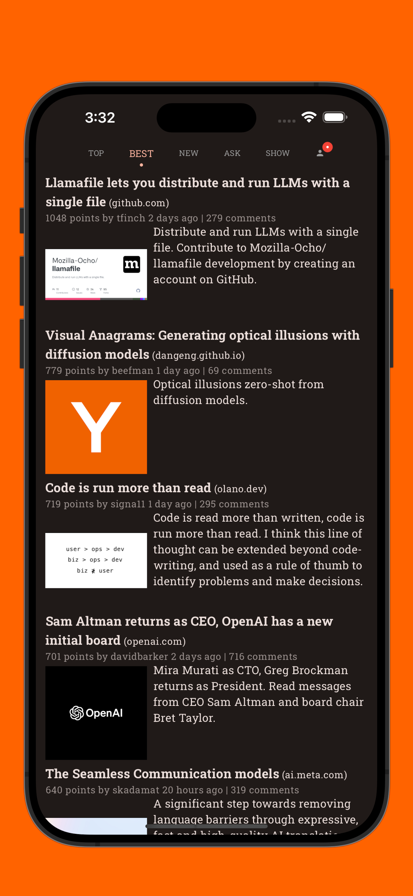 
    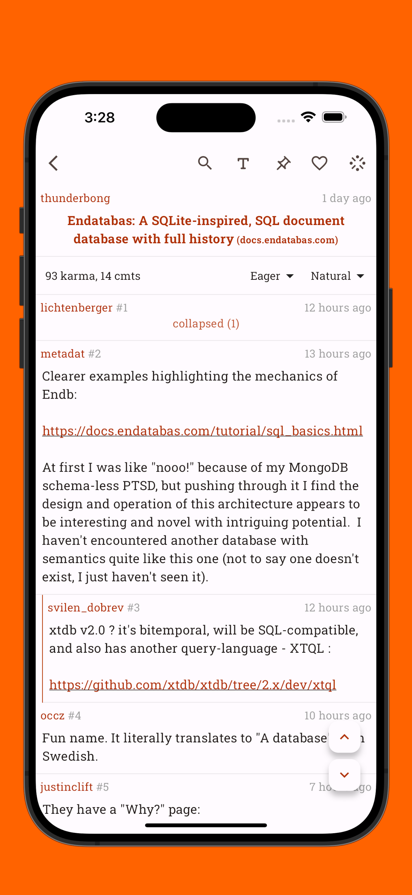
    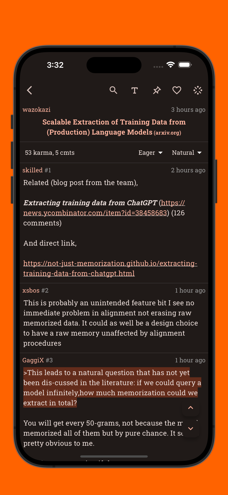
    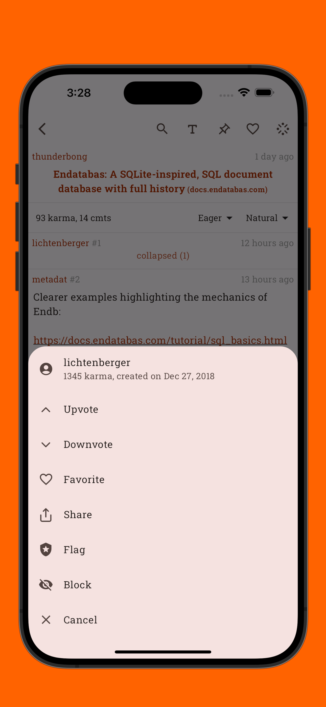 
    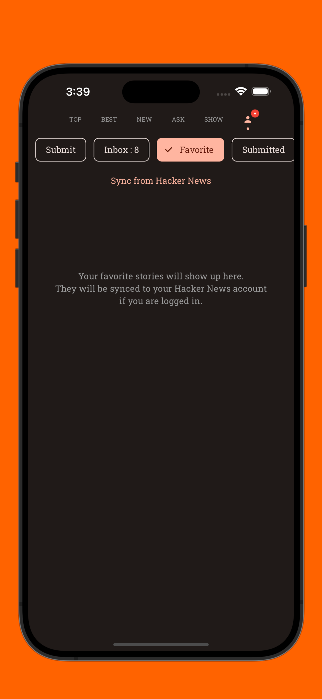
    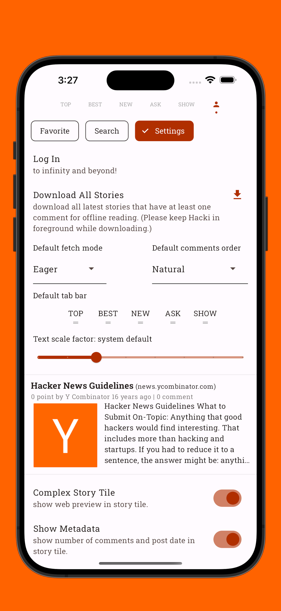 
    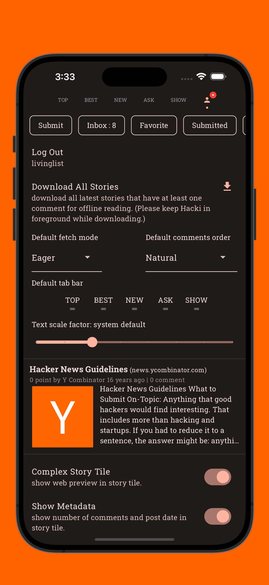 
    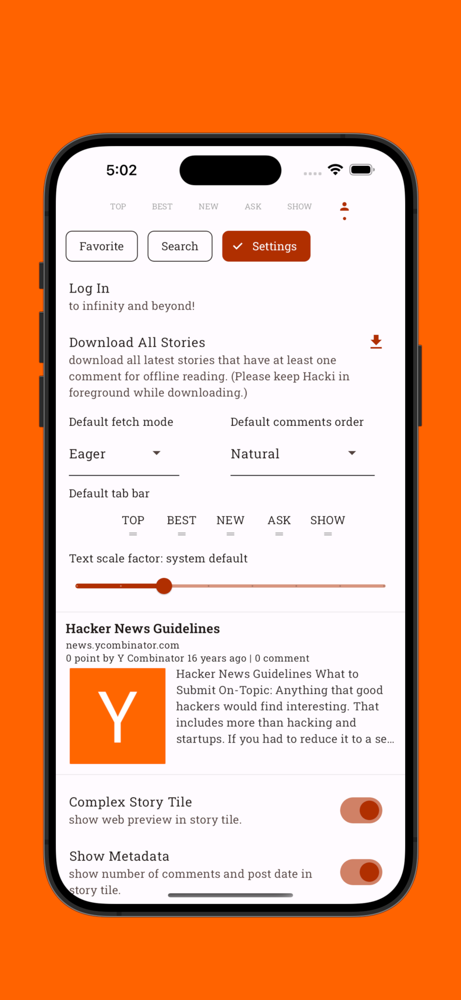
    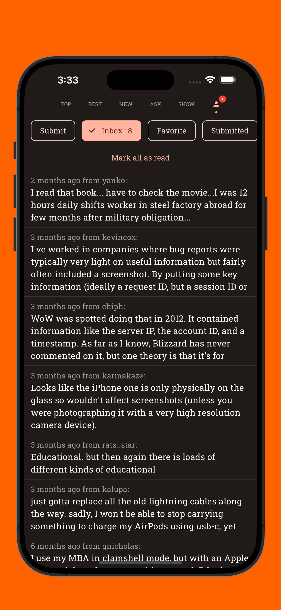 
   
   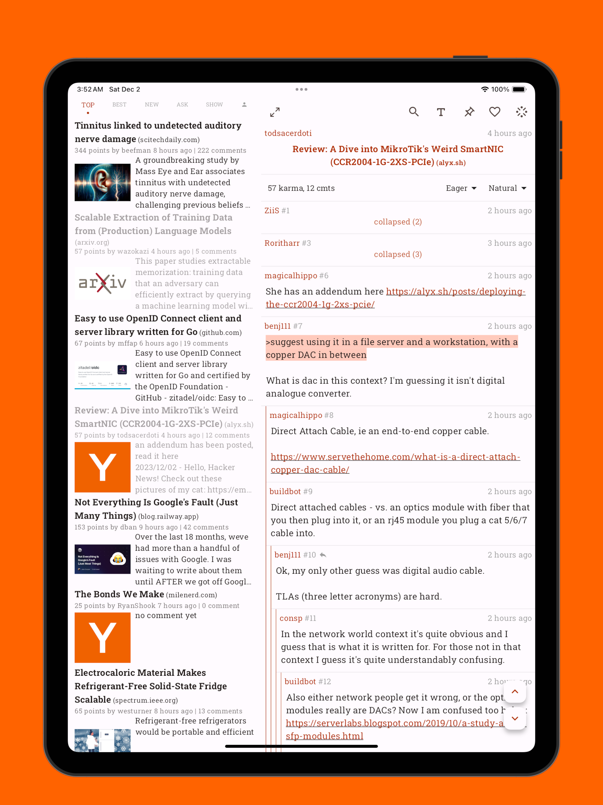 
   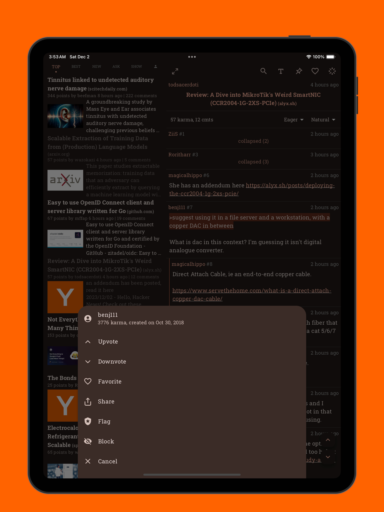 
   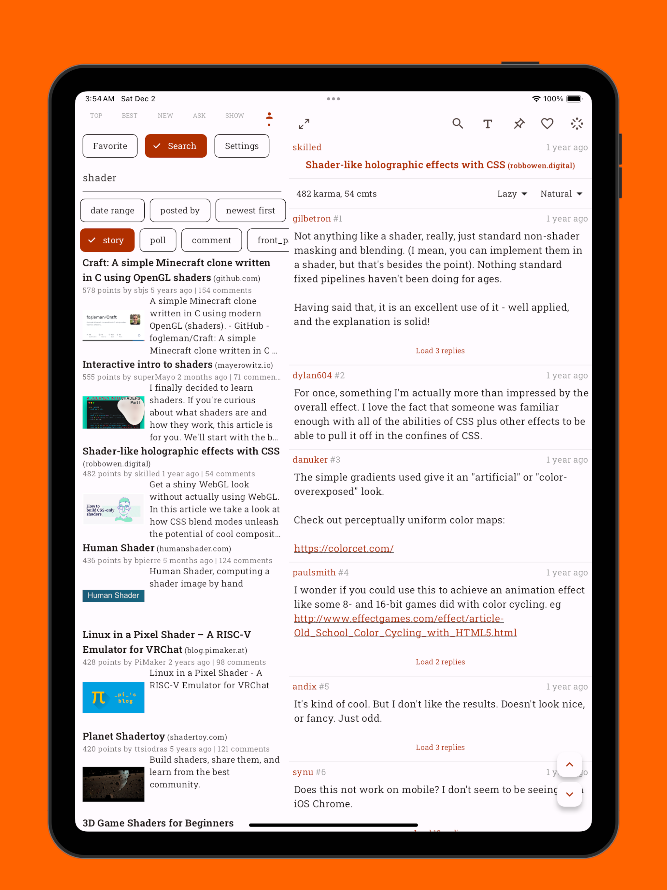 
   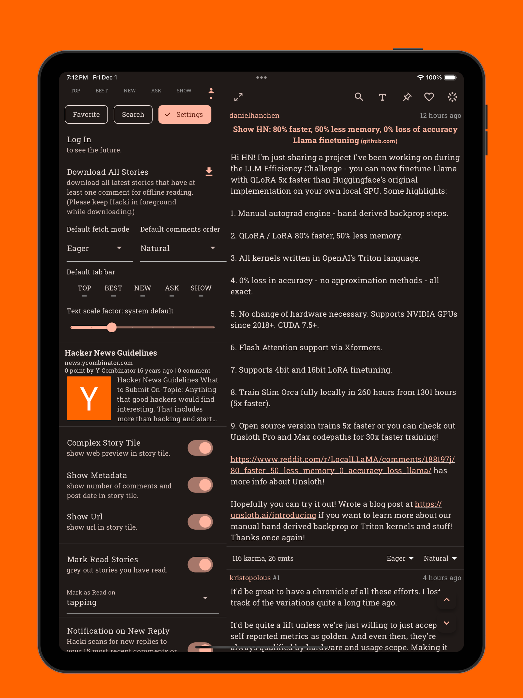 

