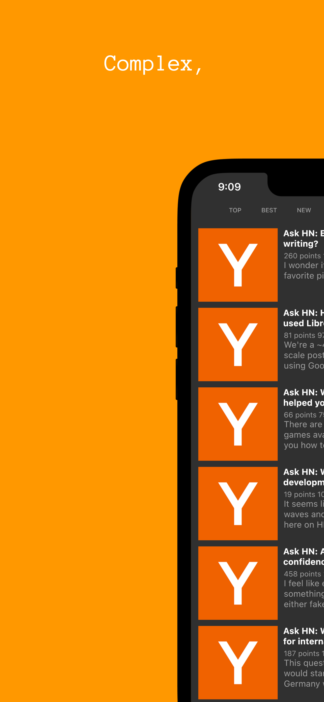
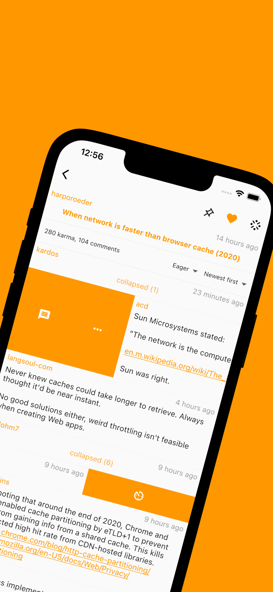
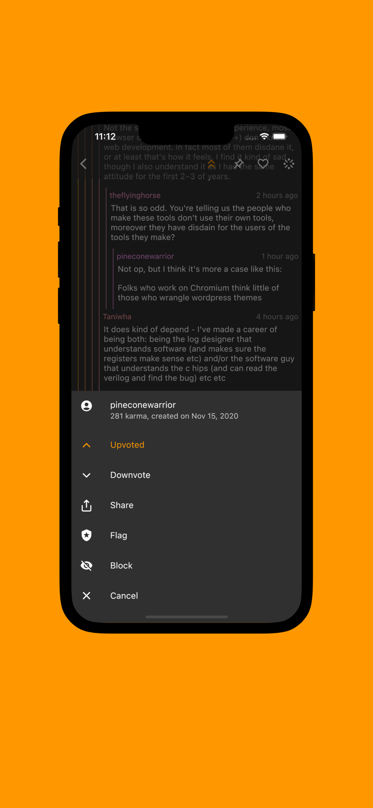
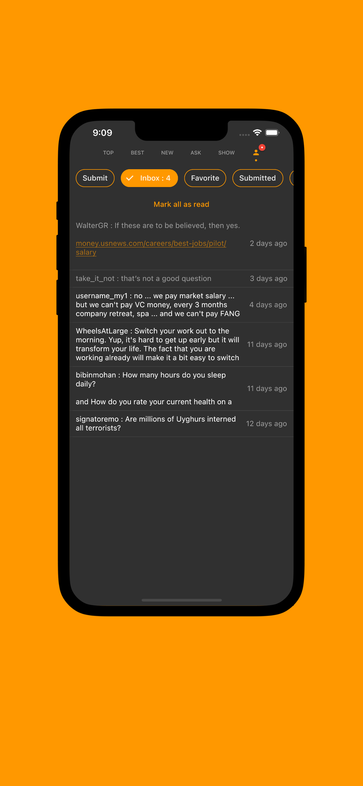
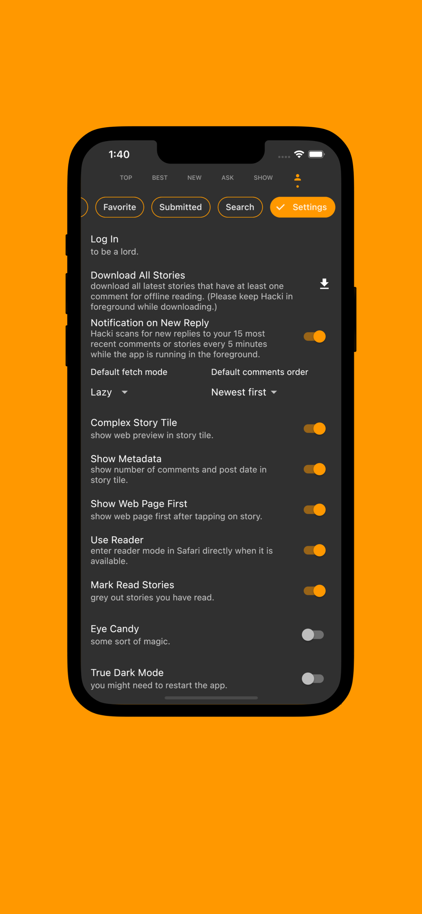

#  Hacki for Hacker News

A simple noiseless [Hacker News](https://news.ycombinator.com/) client made with Flutter that is just enough.

<noscript></noscript>

  

Features:
- Log in using your Hacker News account.
- Browse stories from various categories.
- Search for stories.
- Submit stories.
- Pin stories.
- Mark stories as favorite.
- Leave comments.
- Collapse comments.
- View parent comments without scrolling up.
- View and participate in polls.
- Browse comments and stories you have posted.
- Vote on comments or stories.
- Get in-app notification when there is new reply to your stories or comments.
- Download stories and comments for offline reading.
- Pick up where you left off.
- Synced favorites and pins across devices. (iOS only)
- Launch from system share sheet.
- And more...

    
    
    
    
    
    
    
    
    
    
    
    
   
    
    
    
    
    
    

